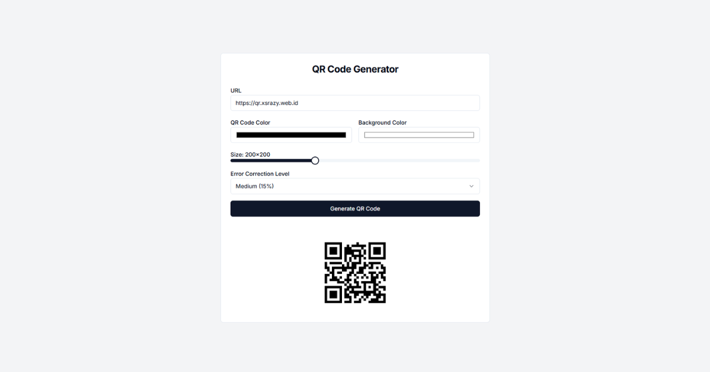

# 🔗 QR Code Generator

A modern, responsive QR Code Generator built with Next.js and React. Generate custom QR codes with full customization options including colors, sizes, and error correction levels.



## ✨ Features

- **🎨 Full Customization**: Change QR code colors, background colors, and sizes
- **📏 Flexible Sizing**: Adjustable QR code dimensions from 100x100 to 400x400 pixels
- **🛡️ Error Correction**: Multiple error correction levels (Low, Medium, Quartile, High)
- **📱 Responsive Design**: Works perfectly on desktop, tablet, and mobile devices
- **⚡ Real-time Generation**: Instant QR code generation as you type
- **🔗 URL Validation**: Built-in URL validation for accurate QR codes
- **🎯 Clean UI**: Modern interface built with shadcn/ui components
- **🚀 Fast Performance**: Optimized with Next.js 15 and React 18

## 🛠️ Technologies Used

- **Framework**: [Next.js 15](https://nextjs.org/) with App Router
- **Frontend**: [React 18](https://reactjs.org/) with TypeScript
- **Styling**: [Tailwind CSS](https://tailwindcss.com/)
- **UI Components**: [shadcn/ui](https://ui.shadcn.com/)
- **QR Generation**: [qrcode.react](https://github.com/zpao/qrcode.react)
- **Icons**: [Lucide React](https://lucide.dev/)

## 🚀 Getting Started

### Prerequisites

- Node.js 18+ 
- npm, yarn, or pnpm

### Installation

1. **Clone the repository**
   ```bash
   git clone https://github.com/xsrazy/qr-code-generator.git
   cd qr-code-generator
   ```

2. **Install dependencies**
   ```bash
   npm install
   # or
   yarn install
   # or
   pnpm install
   ```

3. **Run the development server**
   ```bash
   npm run dev
   # or
   yarn dev
   # or
   pnpm dev
   ```

4. **Open your browser**
   Navigate to [http://localhost:3000](http://localhost:3000) to see the application.

## 📖 Usage

1. **Enter a URL**: Type or paste any valid URL in the input field
2. **Customize Colors**: Use the color pickers to change QR code and background colors
3. **Adjust Size**: Use the slider to set your preferred QR code dimensions
4. **Set Error Correction**: Choose the appropriate error correction level for your needs
5. **Generate**: Click "Generate QR Code" to create your custom QR code
6. **Save**: Right-click on the generated QR code to save it as an image

### Error Correction Levels

- **Low (7%)**: Best for clean environments
- **Medium (15%)**: Standard level for most use cases
- **Quartile (25%)**: Good for slightly damaged surfaces
- **High (30%)**: Best for harsh environments or small QR codes

## 🎨 Customization Options

- **QR Code Color**: Any hex color for the QR code pattern
- **Background Color**: Any hex color for the background
- **Size**: 100px to 400px (adjustable in 10px increments)
- **Error Correction**: L, M, Q, H levels available
- **Margin**: Automatic margin inclusion for better scanning

## 📱 Responsive Design

The application is fully responsive and works seamlessly across:
- 🖥️ Desktop computers
- 📱 Mobile phones
- 📟 Tablets
- 💻 Laptops

## 🔧 Project Structure

```
qr-code-generator/
├── app/
│   ├── layout.tsx          # Root layout with metadata
│   ├── page.tsx            # Main QR generator component
│   └── globals.css         # Global styles
├── components/
│   └── ui/                 # shadcn/ui components
├── public/
│   ├── favicon.png         # Site favicon
│   └── og-image.png        # Social media preview image
├── styles/
│   └── globals.css         # Tailwind CSS configuration
└── README.md
```

## 🌐 Live Demo

Visit the live application: [https://qr.xsrazy.web.id](https://qr.xsrazy.web.id)

## 📸 Screenshots

### Desktop View


### Features Overview
- ✅ Real-time QR code generation
- ✅ Color customization
- ✅ Size adjustment
- ✅ Error correction levels
- ✅ Mobile responsive
- ✅ Clean, modern UI

## 🤝 Contributing

Contributions are welcome! Please feel free to submit a Pull Request. For major changes, please open an issue first to discuss what you would like to change.

### Development Guidelines

1. Fork the repository
2. Create your feature branch (`git checkout -b feature/AmazingFeature`)
3. Commit your changes (`git commit -m 'Add some AmazingFeature'`)
4. Push to the branch (`git push origin feature/AmazingFeature`)
5. Open a Pull Request

## 📄 License

This project is licensed under the MIT License - see the [LICENSE](LICENSE) file for details.

## 👨‍💻 Author

**Xsrazy**
- Website: [https://xsrazy.web.id](https://xsrazy.web.id)
- GitHub: [@xsrazy](https://github.com/xsrazy)

## 🙏 Acknowledgments

- [Next.js](https://nextjs.org/) for the amazing React framework
- [shadcn/ui](https://ui.shadcn.com/) for the beautiful UI components
- [qrcode.react](https://github.com/zpao/qrcode.react) for QR code generation
- [Tailwind CSS](https://tailwindcss.com/) for utility-first CSS

## 📊 Project Stats


---

⭐ **If you found this project helpful, please give it a star!** ⭐

Made with ❤️ by [Xsrazy](https://xsrazy.web.id)

---

## 💰 You can help me by Donating
  [](https://buymeacoffee.com/xsrazy) [](https://paypal.me/xsrazy) [](https://patreon.com/Xsrazy) [](https://ko-fi.com/xsrazy)
